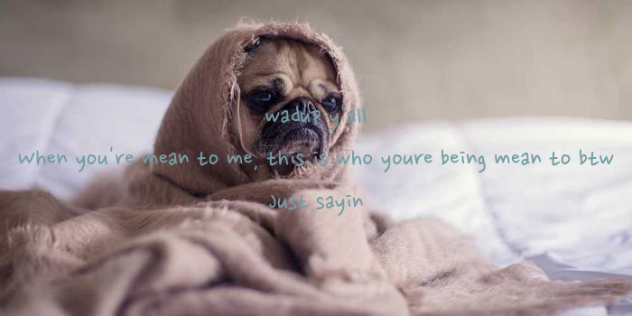
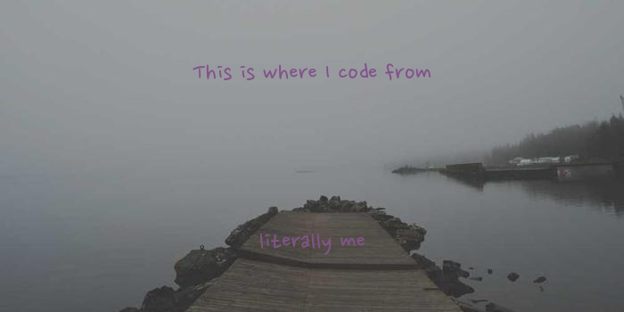
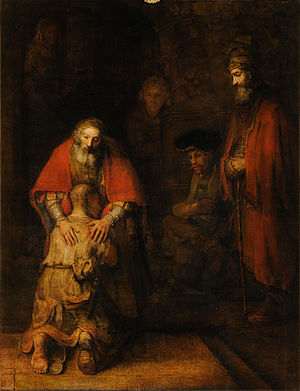

# Existence Precedes Essence

> my name is aj, I am a modern human. Which means I am the consecuence of old world ideology, confronting new world problems. I was 8 years old when Ronald Reagan died and I consume about 5 grams of plastic a year; Maybe a little more due to the pica I've recently been diagnosed with. I'm 27 at the time I write this, I live in Oaxaca Mexico; Working as a Medical Coder.
> I want to have a job with a bigger impact. I want to be relevant. I want to actually help. Cus like... wtf is medical coding. But everytime I ask myself, what I would love to do. What job could nourish and develop as many aspects of my life as possible? Social, economic, creative, self-meaning. 
> I always get too metaphysical. Who was I born as? Not sure, can't remember. Certainly *someone*. Since a young age I've felt a fascination towards finding my true self. I wished to shed every social aspect of my being, I wished to look myself in the mirror and see, I wished to obey the will of no one but my true self.
>
> So what has stopped me? Doubt. The curse every hyperrational modern shares. Perhaps after taking off the social mask, nothing of much significant value would remain. Perhaps I would just be adopting another mask, equally fake. Perhaps this mask is the best one I got. Perhaps, or maybe, yes... wait... no... perhaps.
>
> The value of any human life starts as a social measure, which transforms the inner measure; The inner measure then transforms our social behavior; Our social behavior defines our existencial value.
> **WHAT!?!?**
> ### *Can* society define the value of a human? 
>
> Isolate a man from society and he loses all relevance. Which of the human values remain once relevance has left?
>
> I fight for relevance. I wish for my acts to be far from futile. For my love to not be impotent.

# Individuality of the Social Being

### *"Prayer does not change God, but it changes him who prays."* - Sorek Kierkegaard

> We may not be able to change society in a single lifetime. Those who claim to have changed the world single-handedly, fighting a heroic battle and changing the world for the better, is lying. "Everybody has a mother", is a traditional Mexican saying. I love the implication behind this, we all need to be nurtured and we all need support. Even if only from our Mother, even if only from a friend or a cherished pet.
> There will always be someone in the shadows ofevery heroic act. Someone who supported our idols and isn't receiving the credit they deserve.
> 
> Society drowns us in the waters of Time. Yet, society allows us to *practice* what we have cultivated in intimacy. Society will always be there, just a step outside our door. Society is a force larger than each individual, yet each individual can increase the force of society. If my work consists of making society a better place, I may, consequently, better my self.

<!--
**ajzenna/ajzenna** is a ✨ _special_ ✨ repository because its `README.md` (this file) appears on your GitHub profile.

Here are some ideas to get you started:

- 🔭 I’m currently working on ...
- 🌱 I’m currently learning ...
- 👯 I’m looking to collaborate on ...
- 🤔 I’m looking for help with ...
- 💬 Ask me about ...
- 📫 How to reach me: ...
- 😄 Pronouns: ...
- ⚡ Fun fact: ...
-->
